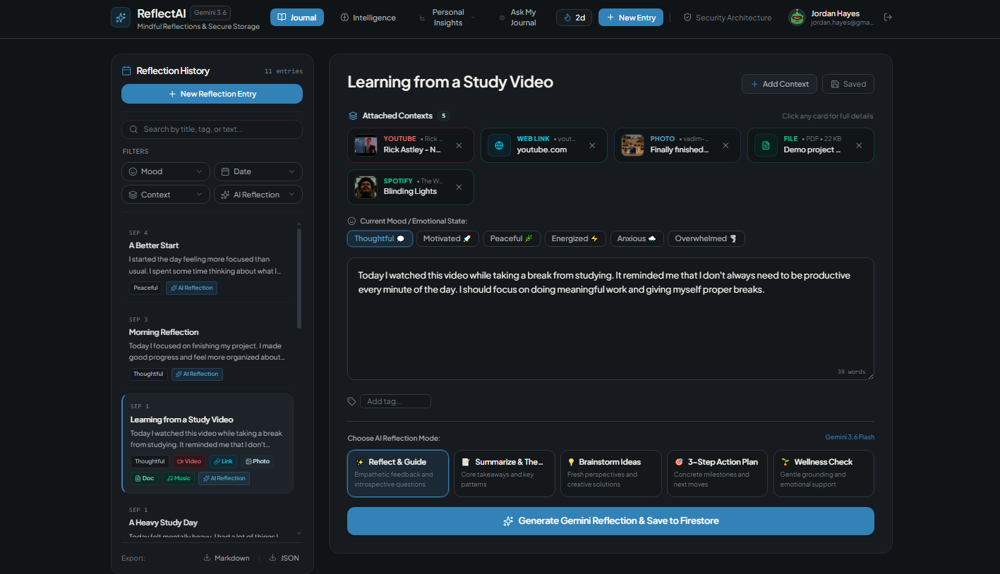
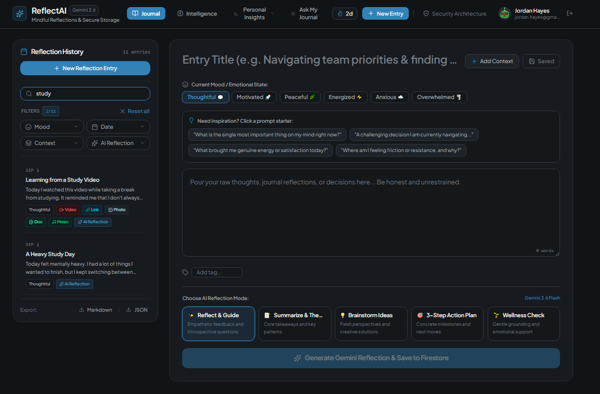
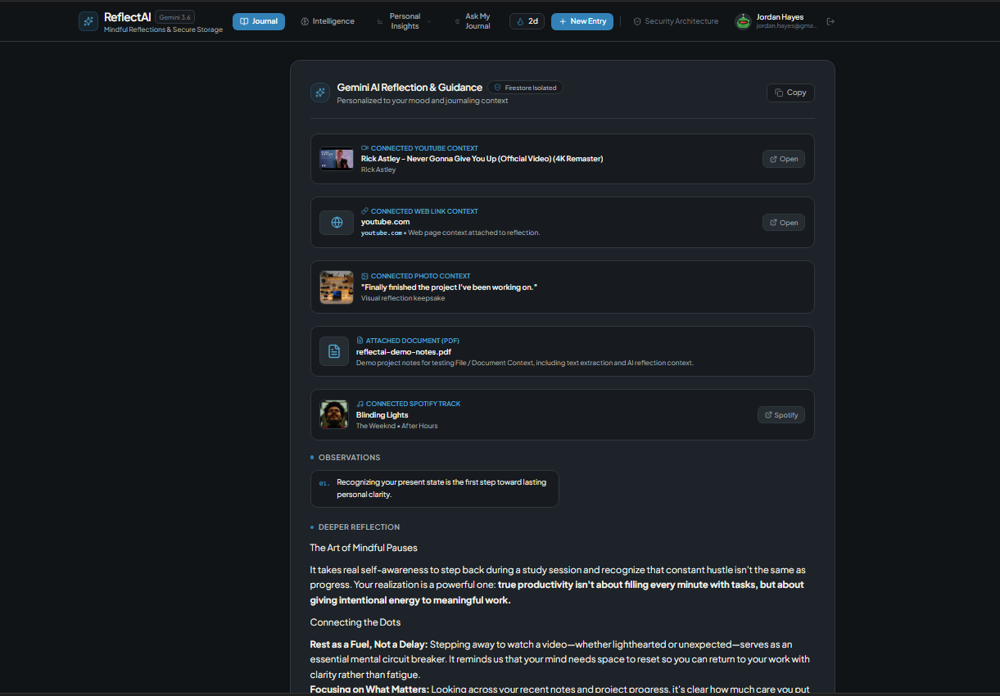
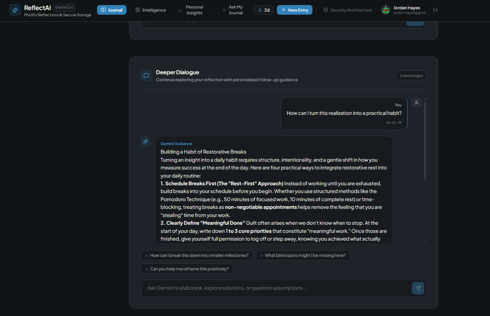
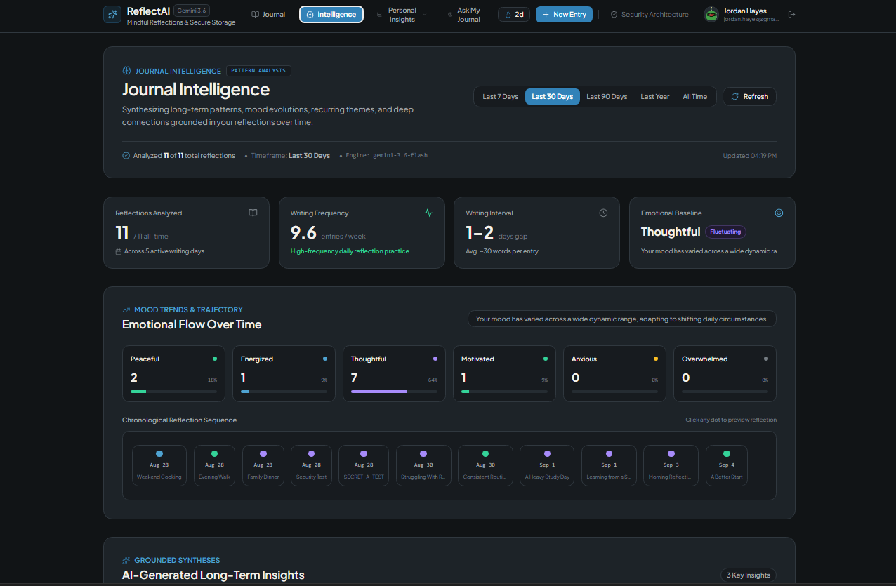
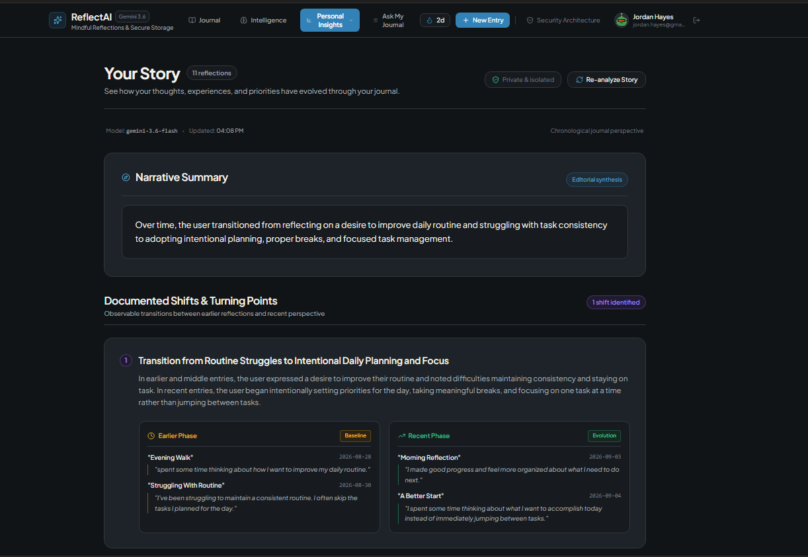
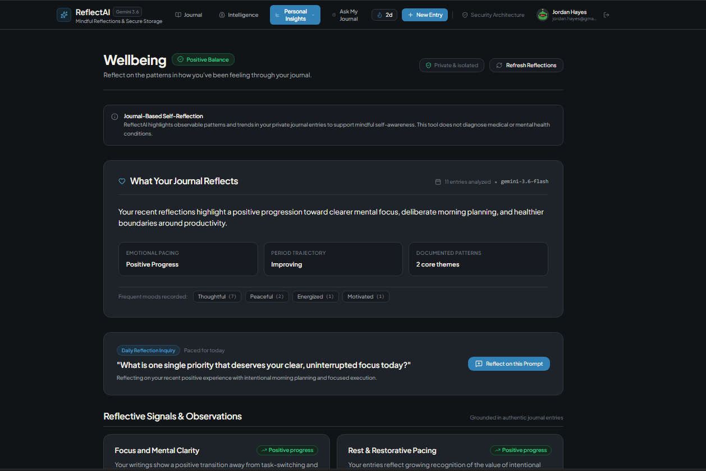
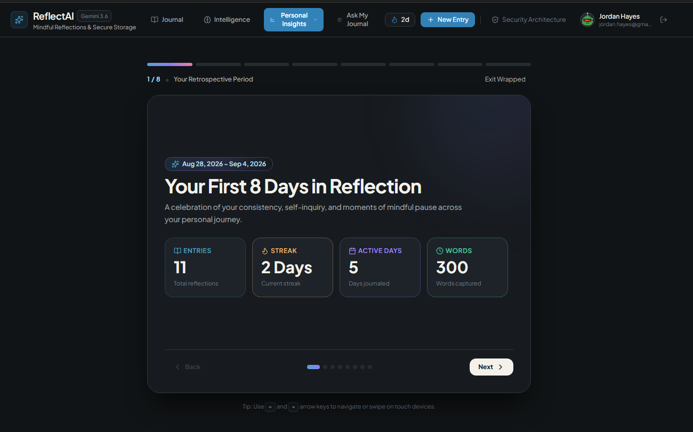
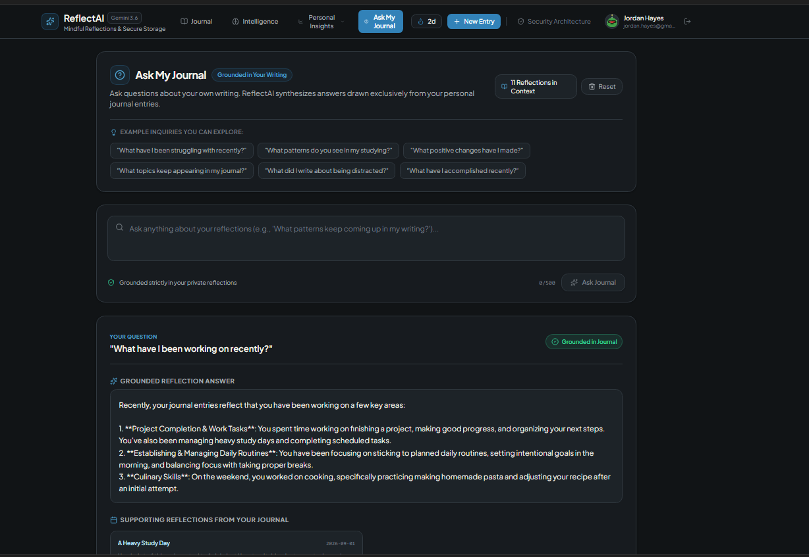
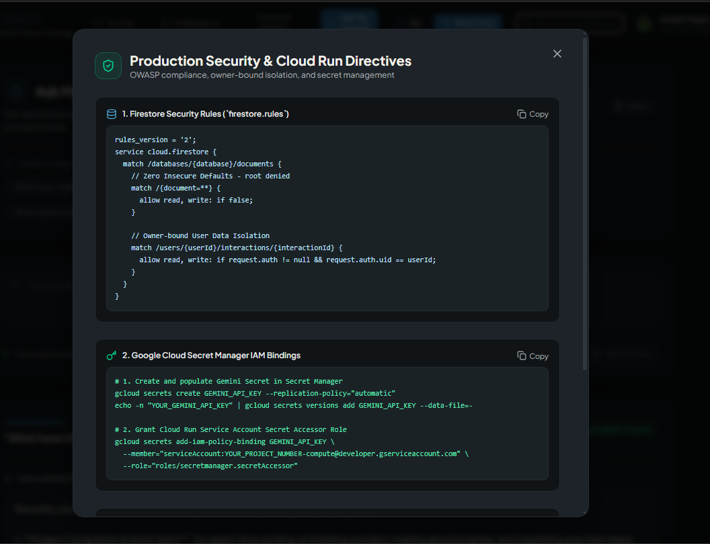

# ReflectAI Journal

> **Your journal comes first. AI helps you understand it.**

ReflectAI Journal is a private, user-authenticated journaling application that combines everyday writing with grounded Gemini-powered reflection and long-term personal insight.

Instead of treating AI as the main interface, ReflectAI keeps the journal at the center. Users write about their experiences, attach useful context, reflect with Gemini, continue the conversation, and explore patterns across their own writing over time.

The project started from the Google AI Studio + Cloud Run challenge starter application and was substantially extended with a custom product experience, multiple journal-intelligence features, context integrations, offline-first persistence, AI resilience, search and discovery tools, and a complete visual redesign.

---

## ✨ What Makes ReflectAI Different

The original challenge provides the foundation of Firebase Authentication, Gemini interaction, Firestore persistence, and Cloud Run deployment. ReflectAI builds a much broader journaling experience on top of that foundation.

### Challenge foundation

- Firebase Authentication
- User-isolated Firestore persistence
- Gemini API interaction
- Cloud Run deployment

### ReflectAI extensions

- Five reflection modes
- Deeper Dialogue
- Ask My Journal
- Journal Intelligence
- Your Story
- Wellbeing
- Personal Wrapped
- Context integrations
- Offline-first local persistence
- Search and combined filtering
- AI fallback behavior
- Complete journal-first UI/UX redesign

### Core journaling
- Create and edit journal entries
- Titles, moods, tags, and writing content
- Draft and save workflow
- Reflection history
- Consecutive-day writing streaks
- Markdown and JSON export
- Offline-first local persistence
- Firestore synchronization when available

### AI reflection
Each entry can be processed through five reflection modes:

1. **Reflect & Guide**
2. **Summarize & The...**
3. **Brainstorm Ideas**
4. **3-Step Action Plan**
5. **Wellness Check**

Reflections can surface observations, deeper reflection, key reflections, questions for further thought, actionable takeaways, and follow-up questions.

### Deeper Dialogue
After generating a reflection, users can continue the same line of thought through a multi-turn Gemini conversation with suggested prompts and persisted conversation context.

### Ask My Journal
Users can ask questions about their own writing, such as what they have been working on recently or what themes appear across their entries. The feature is designed as journal-grounded Q&A rather than a general-purpose chatbot.

### Personal Insights
ReflectAI includes a dedicated Personal Insights area with:

- **Journal Intelligence** for mood, timeline, frequency, and journal-derived patterns
- **Your Story** for narrative summaries and documented turning points
- **Wellbeing** for non-diagnostic, journal-based reflective signals
- **Personal Wrapped** for a retrospective view of journal activity, milestones, patterns, and highlights

### Context integrations
Entries can be enriched with:

- YouTube videos
- Web links
- Photos/images
- Files/documents
- Spotify/music

These context items can be carried into the reflection experience so Gemini has more relevant material to work with.

---

## 🧭 Product Experience

ReflectAI is organized around a simple hierarchy:

```text
Your thoughts
     ↓
Reflection
     ↓
Deeper intelligence
```

The main navigation provides access to:

- Journal
- Intelligence
- Personal Insights
  - Overview
  - Your Story
  - Wellbeing
  - Wrapped
- Ask My Journal

The interface was redesigned from the challenge starter to create a journal-first, editorial experience rather than an AI dashboard.

---

## 🔍 Search & Discovery

Reflection History includes search and combined filtering.

### Search
- Entry title
- Entry content
- Tags

### Filters
- Mood
- Date range
- Context type
- AI reflection
- Multiple filters together

The history view is intentionally designed as an editorial archive so users can quickly find previous writing without turning every entry into a large dashboard card.

---

## 💾 Offline-First Architecture

ReflectAI is designed to remain useful when cloud synchronization is temporarily unavailable.

```text
┌─────────────────────┐
│    ReflectAI UI     │
└──────────┬──────────┘
           │
           ▼
┌─────────────────────┐
│ Local persistence   │
│     localStorage    │
└──────────┬──────────┘
           │
           │ sync when available
           ▼
┌─────────────────────┐
│    Cloud Firestore  │
└─────────────────────┘
```

Journal data uses the `reflectai_entries_` local-storage namespace. Firestore synchronization is treated as a cloud persistence layer rather than the only place where the user's current writing can exist.

If Firestore synchronization is temporarily unavailable, the application can continue working with locally persisted journal data instead of making the entire journaling experience unusable.

---

## 🤖 Gemini Architecture

Gemini is used for reflection, dialogue, journal-grounded questions, and longer-term journal analysis.

The application uses the `@google/genai` SDK through its server-side AI integration.

### Model resilience
The AI architecture uses a fallback strategy so a temporary Gemini failure or unavailable model does not necessarily terminate the reflection experience.

```text
Gemini generation
       ↓
Alternative Gemini configuration
       ↓
Local smart-reflection fallback
```

The exact model configuration and fallback behavior are maintained by the application code and can evolve as model availability changes.

### Grounded journal analysis
For Journal Intelligence, Your Story, Wellbeing, and Ask My Journal, the application prepares journal-derived context before requesting Gemini analysis.

The goal is to keep generated observations connected to the user's actual writing rather than allowing the AI to invent personal history.

ReflectAI also treats wellbeing output as reflective assistance rather than medical diagnosis or clinical advice.

---

## 🔐 Security & Privacy

Journal data can be highly personal, so user isolation and credential protection are treated as core requirements.

### Firebase Authentication
- Firebase Authentication provides user identity.
- Google Sign-In is used for authentication.
- Journal ownership is associated with the authenticated Firebase UID.

### User-isolated Firestore data
The application uses owner-bound data paths and authorization checks so a user's journal data is associated with that user's identity.

The security model follows the challenge's owner-isolation principle:

```text
/users/{userId}/interactions/{interactionId}
```

The intended access rule is conceptually:

```text
request.auth != null
AND
request.auth.uid == userId
```

This prevents one authenticated user from accessing another user's journal documents through the owner-bound path.

### Server-side Gemini credentials
The Gemini API credential is handled through the application's server-side secret/environment configuration rather than being intentionally exposed as a browser-side API key.

**Important:** the final deployment does **not** use Google Cloud Secret Manager for Gemini API-key retrieval. The Secret Manager examples from the challenge instructions are therefore documented as security guidance, not as an implemented deployment component.

### Security Architecture UI
ReflectAI includes an in-product **Security Architecture** view that documents the security directives and Firestore isolation approach used during development.

This UI is a documentation/guidance feature. It should not be interpreted as proof that every example shown in the security guidance, such as Secret Manager IAM bindings, is deployed in the current Google Cloud environment.

---

## 🔥 Firebase & Firestore

Firebase provides the identity and cloud data layer for ReflectAI.

### Firebase Authentication
- Google Sign-In
- Authenticated Firebase user identity
- UID-based ownership

### Cloud Firestore
Firestore provides cloud persistence for user-owned application data.

The application also supports a configured Firestore database ID instead of assuming that every environment uses only the default database.

Firestore synchronization is intentionally non-blocking for the local journal experience. Local persistence provides a fallback when cloud synchronization cannot complete.

---

## ☁️ Google Cloud Run

ReflectAI was deployed to Google Cloud Run as part of the Cloud Run AI challenge workflow.

**Cloud Run service:** `reflectai-journal`

**Deployment region:** `us-west2`

The Cloud Run deployment was tested as a production environment before submission. The challenge requires the deployed service to use the verification label:

```text
dev-tutorial=cloud-run-ai-challenge
```

Cloud Run provides the production runtime for the application while Firebase Authentication and Firestore provide identity and cloud persistence.

---

## 🧱 Architecture Overview

```text
                         ┌──────────────────────┐
                         │      User Browser     │
                         │                      │
                         │  ReflectAI React UI  │
                         └──────────┬───────────┘
                                    │
                    ┌───────────────┼────────────────┐
                    │               │                │
                    ▼               ▼                ▼
             Firebase Auth     Local Storage    Server API
                    │               │                │
                    │               │                ▼
                    │               │         Gemini / AI layer
                    │               │                │
                    ▼               ▼                │
               Firestore ◄──── Sync / Save ─────────┘
```

### Responsibility split

| Layer | Responsibility |
|---|---|
| React / TypeScript UI | Journal editing, navigation, history, insights, conversations, context UI |
| Firebase Authentication | User identity and Google Sign-In |
| Local storage | Offline-first journal persistence |
| Firestore | Cloud persistence and user-isolated data |
| Server/API layer | Gemini requests and server-side credential handling |
| Gemini | Reflection, dialogue, grounded journal analysis |
| Cloud Run | Production application runtime |

---

## 🎨 Visual & UX Redesign

ReflectAI was substantially redesigned rather than retaining the visual language of the starter application.

### Design direction
- Dark neutral foundation
- Bright blue primary accent
- Warm off-white primary text
- Calm editorial surfaces
- Semantic colors for meaningful states
- Minimal visual noise
- Blue used as an accent rather than a full-page background
- Richer multi-color gradients reserved for Personal Wrapped

### Redesigned areas
- Application shell and navigation
- Journal editor
- Reflection History
- AI Reflection & Guidance
- Deeper Dialogue
- Journal Intelligence
- Your Story
- Wellbeing
- Personal Wrapped
- Ask My Journal
- Security Architecture view

The browser favicon was also redesigned to match the ReflectAI visual identity.

---

## 🛠️ Technology Stack

| Area | Technology |
|---|---|
| Frontend | React + TypeScript |
| AI | Google Gemini + `@google/genai` |
| Authentication | Firebase Authentication |
| Database | Cloud Firestore |
| Backend | Node.js server/API layer |
| Production runtime | Google Cloud Run |
| Local persistence | Browser `localStorage` |
| Source control | GitHub |

---

## 📁 Project Structure

```text
.
├── assets/
├── docs/
├── public/
├── src/
│   ├── components/
│   │   ├── AnalyticsModal.tsx
│   │   ├── AskJournalView.tsx
│   │   ├── AttachedContextsGrid.tsx
│   │   ├── AuthModal.tsx
│   │   ├── ContextDetailModal.tsx
│   │   ├── ConversationThread.tsx
│   │   ├── HistorySidebar.tsx
│   │   ├── JournalEditor.tsx
│   │   ├── JournalIntelligenceView.tsx
│   │   ├── LandingHero.tsx
│   │   ├── Navbar.tsx
│   │   ├── PersonalInsightsView.tsx
│   │   ├── ReflectionCard.tsx
│   │   ├── SecurityGuideModal.tsx
│   │   ├── WellbeingView.tsx
│   │   ├── WrappedView.tsx
│   │   └── YourStoryView.tsx
│   ├── lib/
│   │   ├── documentParser.ts
│   │   └── firebase.ts
│   ├── services/
│   │   └── storage.ts
│   ├── App.tsx
│   ├── index.css
│   ├── main.tsx
│   └── types.ts
├── .env.example
├── .gitignore
├── bun.lock
├── firebase-applet-config.json
├── firestore.rules
├── index.html
├── metadata.json
├── package.json
├── README.md
├── server.ts
├── tsconfig.json
└── vite.config.ts
```

### Key areas

- `src/components/` contains the main application views, journal UI, reflection UI, conversations, insights, authentication, context handling, and security guidance.
- `src/lib/firebase.ts` contains Firebase and Firestore configuration.
- `src/lib/documentParser.ts` handles document-related processing.
- `src/services/storage.ts` contains local journal storage functionality.
- `server.ts` provides the server-side application/API layer used for AI functionality.
- `firestore.rules` contains the Firestore security rules.
- `docs/` contains project documentation and screenshots.
- `assets/` contains application assets.
- `public/` contains public/static application files.
- `firebase-applet-config.json` contains the Firebase configuration used by the application.

## 🚀 Getting Started

### Prerequisites

- Bun
- A Firebase project
- Firebase Authentication enabled
- Cloud Firestore enabled
- A Gemini API credential configured for the server-side application
- Google Cloud CLI (`gcloud`) for Cloud Run deployment

### Install dependencies

```bash
bun install
```

### Configure the application

Configure Firebase using the Firebase configuration expected by the project and configure the Gemini credential using the server-side environment/secret mechanism used by the application.

Do **not** commit API keys, tokens, service-account JSON files, or local `.env` files containing secrets.

### Run locally

```bash
bun run dev
```

The exact local development command can vary with the project's current package configuration.

---

## ☁️ Deployment Notes

The application can be deployed to Google Cloud Run after configuring the required Firebase and Gemini environment.

A typical deployment workflow is:

```text
1. Configure Firebase Authentication + Firestore
2. Configure the server-side Gemini credential
3. Build the application
4. Deploy the application to Cloud Run
5. Verify authentication and journal persistence
6. Verify Gemini reflection and dialogue
7. Verify user isolation
8. Apply the challenge verification label
9. Test the production URL
```

For the challenge submission, the deployed service used:

```text
Service: reflectai-journal
Region: us-west2
Label: dev-tutorial=cloud-run-ai-challenge
```

---

## 🧪 Testing Checklist

Before considering a deployment complete, verify the following user flows:

### Authentication
- Google Sign-In works
- Authenticated user reaches the private application
- Sign-out works
- A different account does not see another user's journal data

### Journaling
- Create an entry
- Edit an entry
- Save an entry
- Reload the application
- Search entries
- Apply and reset filters
- Calculate the writing streak
- Export journal data

### AI reflection
- Run each of the five reflection modes
- Verify generated output is displayed correctly
- Verify a temporary Gemini failure can fall back appropriately
- Continue a reflection through Deeper Dialogue

### Journal intelligence
- Open Journal Intelligence
- Generate/view journal-derived patterns
- Open Your Story
- Open Wellbeing
- Open Personal Wrapped
- Ask a grounded question through Ask My Journal

### Context
- Add YouTube context
- Add web-link context
- Add photo/image context
- Add file/document context
- Add Spotify/music context
- Verify attached context appears in the relevant journal/reflection experience

### Resilience
- Verify journal work remains available when Firestore synchronization is temporarily unavailable
- Verify failures do not silently discard user input
- Verify the production deployment responds correctly through Cloud Run

---

## 📸 Screenshots

The repository showcase uses the following screenshots from the final application:

```text
docs/
└── screenshots/
    ├── 01-journal-editor.png
    ├── 02-history-search.png
    ├── 03-ai-reflection-with-context.png
    ├── 04-deeper-dialogue.png
    ├── 05-journal-intelligence.png
    ├── 06-your-story.png
    ├── 07-wellbeing.png
    ├── 08-personal-wrapped.png
    ├── 09-ask-my-journal.png
    └── 10-security-architecture.png
```

These screenshots demonstrate the main product areas, including the journal-first editor, discovery tools, Gemini reflection, deeper dialogue, personal intelligence, retrospective experiences, and security guidance.

### Final Application Screenshots

#### 1. Journal Editor


#### 2. History & Search


#### 3. AI Reflection with Context


#### 4. Deeper Dialogue


#### 5. Journal Intelligence


#### 6. Your Story


#### 7. Wellbeing


#### 8. Personal Wrapped


#### 9. Ask My Journal


#### 10. Security Architecture


---

## 🔗 Project Links

### Public Repository

`https://github.com/jaikishan1234/reflectai-journal`

### Cloud Run

The project was deployed as `reflectai-journal` in `us-west2` for production verification and challenge submission.

**Live URL:** https://reflectai-journal-p5nlhe4wua-wl.a.run.app

### Product Walkthrough

**Video:** https://drive.google.com/file/d/1eljm0qEaSJ4ZA-n43j4BFR94HxP4x0YV/view?usp=sharing

The no-voice-over walkthrough demonstrates the complete product experience, including authentication, journaling, context integrations, Gemini reflection, Deeper Dialogue, Personal Insights, Wrapped, and Ask My Journal.

### Project Blog

**Blog:** https://dsadigest.hashnode.dev/building-ai-agents-with-google-cloud-my-journey-through-three-tracks

The blog will explain the problem behind ReflectAI, the product design, Firebase and Firestore architecture, Gemini integration, Cloud Run deployment, security approach, offline-first behavior, and the major extensions beyond the challenge starter.

---

## ⚠️ Limitations

- Gemini output can be imperfect and should be treated as reflective assistance rather than authoritative advice.
- Wellbeing features are not medical or diagnostic systems.
- Cloud synchronization depends on Firebase/Firestore availability.
- External context functionality depends on the corresponding service and available metadata.
- Offline persistence improves resilience but does not replace cloud synchronization as the long-term shared data layer.
- AI-generated insights are grounded in available journal context and should not be interpreted as complete psychological or personal assessments.

---

## 🔮 Future Improvements

Potential future directions include:

- More sophisticated semantic retrieval across large journals
- Stronger long-term memory and context selection
- More granular privacy controls
- More advanced journal analytics
- Improved synchronization conflict handling
- More context-aware multi-turn conversations
- Additional user-controlled AI personalization

---

## 🏆 Challenge Context

ReflectAI Journal was developed from the Google AI Studio and Cloud Run challenge starter application and expanded substantially beyond the baseline journaling flow.

The challenge emphasizes originality, usability, stability, and security. ReflectAI addresses those goals through its custom product experience, journal intelligence features, context-aware reflection, offline-first behavior, user-isolated Firestore architecture, server-side AI credential handling, resilience mechanisms, and production Cloud Run deployment.

The Google codelab also makes an important distinction between the security directives provided to Google AI Studio and the application's final deployed infrastructure. The Secret Manager examples in the directives are instructions for the coding agent; they are not represented here as an implemented Secret Manager integration.

---

## 📄 Final Summary

ReflectAI Journal combines:

**Private journaling + grounded Gemini reflection + long-term personal insight + Firebase/Firestore persistence + Cloud Run deployment**

The product is built around one idea:

> **Your journal comes first. AI helps you understand it.**

